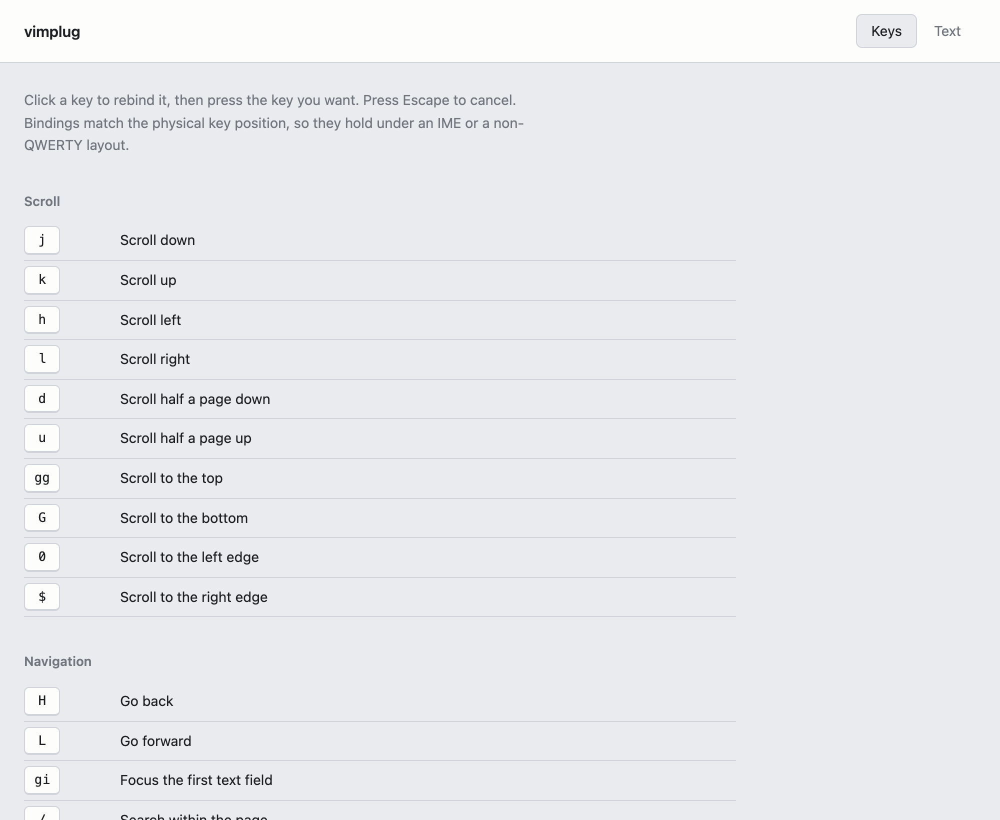

# vimplug

Keyboard-driven browser control for Safari and Chrome.

Scroll, follow links, switch tabs, search a page and select text without leaving the home
row. Every key is rebindable, and the configuration is one block of text you can read,
version and carry between machines.



## Why this exists

Vimium is excellent and does not run on Safari. Vimkey did, but it is closed source and no
longer maintained: its issue tracker holds years of unanswered reports, several of them
about the extension eating keystrokes meant for the page.

vimplug is a rewrite, not a fork — the original source was never published. It reaches key
parity with vimkey, adds what Vimium users expect, and treats the reports vimkey never
answered as the specification for what must not go wrong.

## Install

There is no signed release. Safari only keeps an extension installed if its containing app
carries an Apple Developer ID, which costs $99 a year, so vimplug is built from source
until that is funded ([#10](https://github.com/m1ngsama/vimplug/issues/10)). Chrome and Edge
have the same story for now.

**Safari.** Needs Safari 16.4+ (macOS 13.3+) and Xcode.

```sh
pnpm install && pnpm build:app
```

Drag `dist/vimplug.app` to `/Applications` and open it once — that is what puts vimplug in
Safari's extension list. Then, in Safari:

1. Settings > Advanced > check "Show features for web developers".
2. Settings > Developer > check "Allow unsigned extensions". **This resets every time
   Safari quits**, and an unsigned build needs it ticked again at the next launch. It is
   the one thing a paid Apple account would remove.
3. Settings > Extensions > enable vimplug, and set site access to "Always Allow on Every
   Website". Without site access the extension silently does nothing, which looks exactly
   like a broken build.

[docs/SAFARI.md](docs/SAFARI.md) covers the rest, including what Safari withholds and what
signing would change.

**Chrome or Edge.** Build, then load `dist/chrome` at `chrome://extensions` with developer
mode on.

```sh
pnpm install && pnpm build
```

## Keys

Defaults. Every one is rebindable; `?` shows the bindings actually in force.

| Keys | Action |
| --- | --- |
| `j` `k` `h` `l` | Scroll; hold to keep going |
| `d` `u` | Scroll half a page |
| `gg` `G` | Top, bottom |
| `0` `$` | Left edge, right edge |
| `f` | Hint clickable elements |
| `F` | Hint, opening links in a new tab |
| `o` | Open a URL or search |
| `T` | Search open tabs |
| `t` | New tab |
| `b` | Search bookmarks |
| `yf` | Copy a link URL by hint |
| `J` `K` | Previous, next tab |
| `^` | Back to the tab you were just on |
| `<` `>` | Move the tab left, right |
| `g0` `g$` | First, last tab |
| `H` `L` | Back, forward |
| `r` `x` `X` | Reload, close, reopen tab |
| `yt` | Duplicate tab |
| `yy` | Copy the page URL |
| `p` `P` | Open the clipboard URL here, in a new tab |
| `gi` | Focus the first text field |
| `gu` `gU` | Up one URL level, site root |
| `[[` `]]` | Previous page, next page |
| `gf` | Focus an iframe by hint |
| `i` | Suspend vimplug until Esc |
| `-` `=` `m` | Media volume down, up, mute |
| `/` `n` `N` | Find in page, next, previous |
| `M` `` ` `` | Set a mark, jump to it |
| `v` | Visual mode |
| `:` | Run any action by name |
| `?` | Keyboard help |
| `<Esc>` | Leave the current mode |

`m` keeps vimkey's mute, so marks use `M` and `` ` `` rather than vim's `m`.

Most keys take a count: `5j` scrolls five steps, `3K` moves three tabs on. A bare `0` stays
a binding of its own, so a count cannot start with it.

`o` searches your open tabs, bookmarks and history alongside plain URLs and searches. What
you typed is always one of the rows, so Enter never has to guess between navigating and
searching.

Scrolling acts on the pane under the cursor, not only the document, so `j` works in apps
whose page does not itself scroll.

Safari does not grant extensions access to history, bookmarks or closed tabs, so there `o`
searches open tabs only, `b` finds nothing, and `X` cannot reopen a tab. Everything else
behaves the same on both browsers.

While hints are showing, characters that are not a hint label narrow the hints by link
text, and the last remaining candidate fires on its own.

In visual mode `h` `j` `k` `l` `w` `b` `0` `$` extend the selection, `y` copies it, and
`<Esc>` cancels.

Clicking the toolbar button turns vimplug off for the site you are on, and on again. The
button reads `off` where it is disabled.

`/` searches as you type. `<CR>` commits the search: the panel closes, the matches stay,
and `n` and `N` step through them. `<Esc>` cancels instead, putting the page back where it
was before the search moved it. Once a search is committed, `<Esc>` in normal mode clears
the highlights, the way `:noh` does. Queries are smartcase: `/error` ignores case, `/Error`
does not.

Keys pressed while an input method is composing belong to the input method, never to
vimplug, so typing a word in Chinese, Japanese or Korean cannot fire a command.

## Configuration

**Safari.** Settings > Extensions > vimplug > Settings. **Chrome.** Right-click the
toolbar button > Options, or find vimplug on `chrome://extensions`.

The settings page has two views over one configuration. **Keys** lists every action with
its key; click a key and press the one you want. **Text** is the same configuration as
text. The Keys view edits that text in place through the parser's source spans, so your
comments and layout survive a rebind.

```
map <C-d> scrollHalfDown

map <C-[> escape
map <Esc>  escape

site youtube.com {
  unmap j
  unmap k
}

site mail.google.com {
  disable
}

set hintChars = "fjdkslagh"
set keyMatching = physical
```

`keyMatching = physical` (the default) matches the physical key position, so bindings
survive a Chinese IME or a Dvorak layout. Set it to `logical` to match the produced
character instead.

Where two `site` blocks match one host, the more specific pattern wins; ties go to
whichever appears last.

### Colours

`set theme = gruvbox-dark` recolours everything vimplug draws. Built in: `default-dark`,
`default-light`, `gruvbox-dark`, `gruvbox-light`, `nord`, `catppuccin-mocha`,
`catppuccin-latte`, `tokyo-night`, `solarized-dark`, `solarized-light`, and `system`,
which picks a default from your desktop setting.

Light and dark are separate schemes rather than a system setting. Hints are drawn on other
people's pages and have to stand out against the page, not against your desktop.

Any single colour can be overridden on top of a scheme, and a scheme can be set for one
site alone:

```
set theme = nord
set themeAccent = "#ff5f5f"

site github.com {
  set theme = gruvbox-light
}
```

The Text view exports the configuration to a file and reads one back, which is how it
moves between machines. Stored configurations carry a version and are migrated on read, so
an older file keeps working.

## Engine invariants

Four properties hold by construction and are covered by regression tests. Changing any of
them is a behaviour change, not a refactor.

1. **No keydown listener exists in insert mode.** The mode machine is the only thing that
   attaches or detaches it, so typing in a text field has zero overhead.
2. **Modifier combos pass through unless explicitly bound.** Cmd+K, Cmd+I and Cmd+B stay
   with the page.
3. **A disabled host never activates the engine.** Chrome excludes it from injection
   outright; Safari loads a fail-closed bootstrap that confirms the host first.
4. **One engine per frame.** Saving settings re-registers content scripts and can deliver
   the engine to a loading page twice, which would double every keystroke.

Hints and overlays render inside a shadow root and find highlights use the CSS Custom
Highlight API, so nothing the engine draws touches the page's own markup or styles.

## Development

```sh
pnpm check         # tsc --noEmit
pnpm test          # unit tests, no build step
pnpm build         # produces dist/chrome and dist/safari
pnpm build:app     # builds dist/safari, then the Safari app at dist/vimplug.app
pnpm test:engine   # mode semantics against dist/safari, in WebKit and Chromium
pnpm test:e2e      # builds, then drives the artifact in a real Chromium
pnpm sweep         # runs the engine over real sites; needs the network
pnpm icons         # regenerates the icon set
```

Unit tests run on Node's built-in test runner straight from TypeScript, so there is no
test framework and no compile step. Every browser test exercises a build artifact, never a
dev server.

Safari cannot be driven by Playwright, and safaridriver cannot load extensions at all. But
Safari is WebKit, so `pnpm test:engine` injects `dist/safari/content.js` into Playwright's
WebKit behind a small `chrome.*` shim. That covers everything the engine does with the
DOM, focus, event order and input methods. It cannot cover the extension plumbing —
`registerContentScripts`, the disabled-site bootstrap, the background worker, the toolbar
button — which stays manual on Safari and automated on Chrome via `pnpm test:e2e`.

`pnpm sweep` runs the engine over pages nobody here wrote: GitHub, MDN, Wikipedia, Hacker
News. Fixtures cover what we thought of, and one pass over real sites has found defects the
whole fixture suite missed — site shortcuts firing on what is typed into our own panel,
matches running together across unrelated elements, matches in hidden menus. It is not a CI
job: it needs the network, and someone else's redesign would turn it red for no reason. Run
it before a release.

`content.js` must stay under 30KB gzip. `pnpm build` fails if it does not.

## License

GPL-3.0-or-later. See [LICENSE](LICENSE).

vimkey is closed source, which is the reason this project exists; a copyleft license keeps
any fork of vimplug from ending up the same way.
